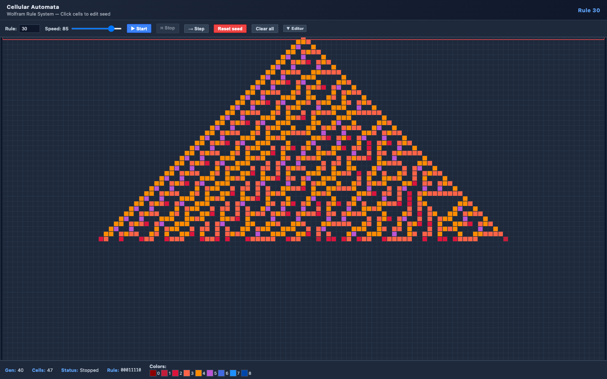

# Zelluläre Automaten

[English](README.md) | [Italiano](README.it.md)

Interaktiver 1D-Zellulärer-Automaten-Visualisierer mit allen 256 Wolfram-Regeln.




## Was sind Zelluläre Automaten?

Ein **zellulärer Automat** (ZA) ist ein diskretes Berechnungsmodell, bestehend aus einem Gitter von Zellen, die jeweils einen von endlich vielen Zuständen annehmen. In jedem Zeitschritt aktualisiert jede Zelle ihren Zustand nach einer festen Regel, die den aktuellen Zustand und die Zustände der Nachbarn berücksichtigt.

### Elementare Zelluläre Automaten (Wolfram-Regeln)

**Elementare zelluläre Automaten** sind die einfachste Klasse: eine eindimensionale Reihe von Zellen, die entweder **an** (1) oder **aus** (0) sind. Der nächste Zustand jeder Zelle hängt von drei Eingaben ab:

```text
  Links  Mitte  Rechts  →  Neuer Zustand
```

Da es 2³ = 8 mögliche Eingabemuster gibt und jedes 0 oder 1 erzeugen kann, existieren genau 2⁸ = **256 mögliche Regeln**, nummeriert von 0 bis 255.

### Wie die Regelnummer funktioniert

Die Regelnummer ist die Dezimalkodierung der 8 Ausgabebits. Zum Beispiel ist **Regel 30** binär `00011110`:

| Muster  | 111 | 110 | 101 | 100 | 011 | 010 | 001 | 000 |
| ------- | --- | --- | --- | --- | --- | --- | --- | --- |
| Ausgabe |  0  |  0  |  0  |  1  |  1  |  1  |  1  |  0  |

Die Ausgaben von links nach rechts gelesen: `00011110` = 30 dezimal.

### Bemerkenswerte Regeln

| Regel   | Verhalten |
| ------- | --------- |
| **30**  | Chaotisches, pseudozufälliges Muster. Wird in Mathematicas Zufallszahlengenerator verwendet. |
| **90**  | Erzeugt das Sierpinski-Dreieck-Fraktal. |
| **110** | Nachweislich Turing-vollständig — fähig zur universellen Berechnung. |
| **184** | Modelliert Verkehrsfluss und ballistische Annihilation. |
| **0**   | Alle Zellen sterben — trivial. |
| **255** | Alle Zellen werden lebendig — trivial. |

### Randbedingungen

Diese Implementierung verwendet **umlaufende** (periodische) Randbedingungen: Die äußerste linke Zelle betrachtet die äußerste rechte Zelle als ihren linken Nachbarn und umgekehrt (Ringtopologie).

### Farbkodierung

Zellen werden nach ihrer **Moore-Nachbarschaftszahl** eingefärbt — die Anzahl lebender Nachbarn in einem 3x3-Bereich über die vorherige, aktuelle und nächste Generation (0–8 Nachbarn). Die Farbskala reicht von Dunkelrot (isoliert) bis Blau (dicht umgeben).

## Benutzung

`index.html` in einem modernen Browser öffnen. Keine Abhängigkeiten, kein Build-Schritt.

### Steuerung

| Steuerung      | Aktion |
| -------------- | ------ |
| **Rule**       | Regelnummer eingeben (0–255) |
| **Speed**      | Schieberegler (0 = langsam, 100 = schnell) |
| **Start/Stop** | Animation starten/pausieren |
| **Step**       | Eine Generation weiter |
| **Reset seed** | Zurück zur Anfangszeile |
| **Clear all**  | Alles zurücksetzen |
| **Editor**     | Visuellen Regeleditor ein-/ausblenden |

### Interaktion

- Klick auf Zellen in der **untersten Zeile** zum Setzen/Löschen
- Die **oberste Zeile** (roter Rahmen) zeigt den Anfangszustand und bleibt fixiert
- Randbedingungen sind umlaufend (toroidal)

## Referenzen

- Wolfram, S. (2002). *A New Kind of Science*. Wolfram Media.
- [Wolfram MathWorld — Elementarer Zellulärer Automat](https://mathworld.wolfram.com/ElementaryCellularAutomaton.html)
- Cook, M. (2004). Universality in Elementary Cellular Automata. *Complex Systems*, 15(1).
